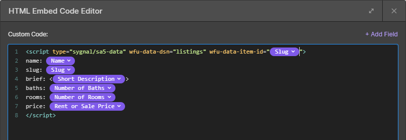

# Dynamic Attributes ❺

## Overview

Webflow's custom attributes feature is much more powerful with the new CMS binding capability- but many important attribute names are reserved to protect unwary web designers from themselves.&#x20;

However in certain cases, the ability to set these attributes is _crucial_.

SA's Dynamic Attributes feature overcomes this by allowing you to create proxy attributes that are then applied to the page once the page has loaded.

### Reserved Attribute Names

If you've never encountered it, this is what happens in Webflow when you attempt to use a reserved attribute name.&#x20;



Here's a partial list of reserved attribute names, as [documented](https://discourse.webflow.com/t/list-feature-availability-limits/23610) by samliew;&#x20;

_abbr, accept, action, align, alt, autofocus, autoplay, bgcolor, border, char, charoff, charset, cite, class, cols, colspan, content, controls, coords, crossorigin, datetime, default, disabled, download, for, form, formaction, formenctype, formmethod, formnovalidate, formtarget, frame, group, headers, height, high, href, hspace, icon, id, ismap, kind, label, list, loop, low, manifest, media, method, multiple, muted, name, optimum, placeholder, poster, preload, radiogroup, readonly, required, reversed, rows, rowspan, sandbox, scheme, scope, scoped, scrolling, seamless, selected, shape, size, sizes, src, srcdoc, srclang, style, type, value, vspace, width, wrap, xmlns, onblur, onclick, ondblclick, ondrag, ondrop, onerror, onfocus, onfocusin, onfocusout, onhelp, oninput, onkeydown, onkeypress, onkeyup, onload, onmousedown, onmouseenter, onmouseleave, onmousemove, onmouseout, onmouseover, onmouseup, onmousewheel, onpaste, onredo, onscroll, onsubmit, onundo_

## Use Cases

This is a more technical feature, but it has an incredible range of uses. Here are a few;

* Use `x-value` = ( your value ) to initialize an INPUT element from a CMS collection item. &#x20;
  * Note, doing this on a Textarea element will initialize it as well, even though the content is bound from inner text.&#x20;
* Use `x-type` = `date` on an INPUT element to change it to a date type&#x20;

## Usage Notes <a href="#usage-notes" id="usage-notes"></a>

### `x-*` attributes <a href="#wfu-sort-attribute" id="wfu-sort-attribute"></a>

Place on any Collection List directly ( not the Collection List Wrapper ). No value is needed.

Any attribute prefixed with `x-` will be processed into the same attribute-value, without the prefix.

e.g. `x-value` = `foo` will be applied as `value` = `foo`&#x20;

When you use this feature with Webflow's CMS-bound attributes, you can initialize the input field's value from any CMS field you choose.&#x20;

## Getting Started ( NOCODE ) <a href="#getting-started-nocode" id="getting-started-nocode"></a>

### STEP 1 - Add the Library <a href="#step-1---add-the-library" id="step-1---add-the-library"></a>

There are currently no configuration options for this library, so we’ll use a _no-code_ integration approach.


This feature is using WFU's v5 new TypeScript-based library, so it is has different URLs and _code placement_ from the v4 JS-based library.&#x20;

You can use both the v4 and v5 libraries simultaneously to get the full feature set during migration.


Add this to the **before HEAD** custom code area of your site or page.


```html
<!-- Sygnal Attributes 5 | HTML -->
<script defer
src="https://cdn.jsdelivr.net/gh/sygnaltech/webflow-util@5.2.1/dist/nocode/webflow-html.min.js"
></script> 
```


Nothing is needed in the before BODY code area.&#x20;

### STEP 2 - Apply `x-` prefixed custom attributes to any elements <a href="#step-2---apply-wfu-sort-and-configuration-attributes-to-the-elements-you-want-to-filter" id="step-2---apply-wfu-sort-and-configuration-attributes-to-the-elements-you-want-to-filter"></a>

See above for details.

## Resources




